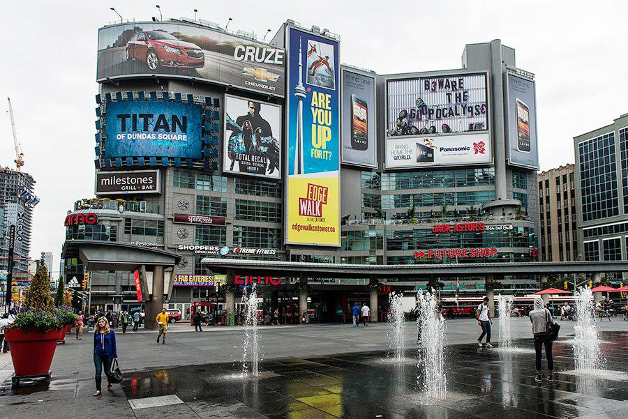
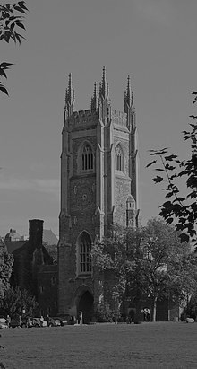
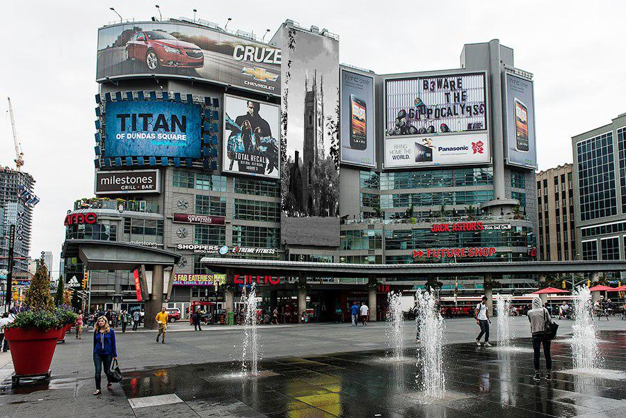

### Project Description
The goal of this project was to create a Python program that performed image translation 
using the Direct Linear Transformation algorithm. In this implementation, an image of Soldiers' Tower 
was translated onto a billboard contained in an image of Yonge and Dundas square. The original Yonge and 
Dundas square image is illustrated below in Figure 1:

*Figure 1: Original Yonge and Dundas Image*

The following is an image of Soldiers' Tower:

*Figure 2: Image of Soldiers' Tower*

There were three stages to translate the Soldiers' Tower image onto the billboard. 
These stages are as follows:
1. The image of Soldiers' Tower was adjusted using histogram equalization
2. The homography matrix between Yonge and Dundas was computed using 4 point 
correspondences
3. A bounding polynomial was defined around the Yonge and Dundas billboard to serve
as a reference for which pixels to map
4. Each pixel on the billboard was mapped from the Soldiers' Tower image using the homography
matrix, H, and bi-linear interpolation

After the above, the following image was produced:

*Figure 4: Yonge and Dundas square with Soldiers' Tower billboard*

